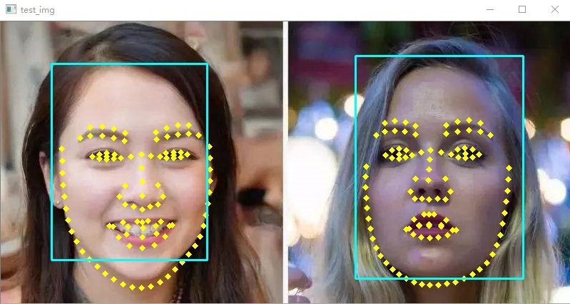

# yoloface50k-landmark106
yoloface50k-landmark106 Implementation with opencv C++
from https://github.com/AIZOOTech/FaceMaskDetection

#### 0x01:result:

#### 0x02:reference
https://github.com/dog-qiuqiu/MobileNet-Yolo/tree/master/yoloface50k-landmark106
